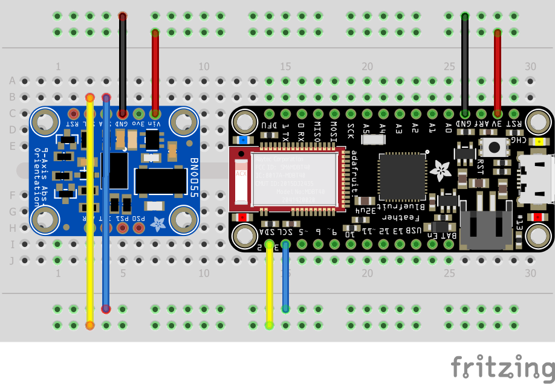
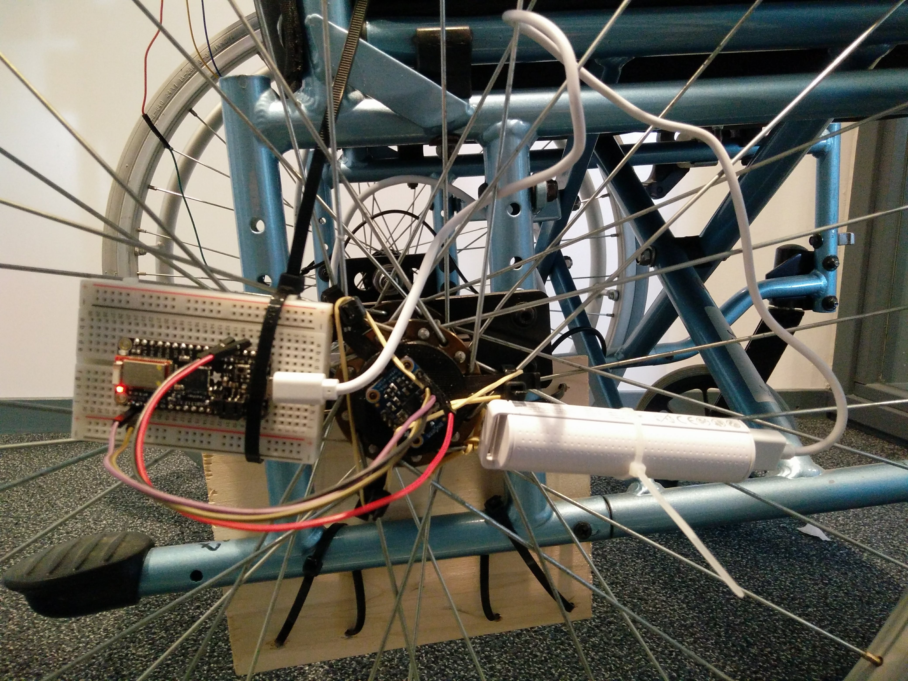
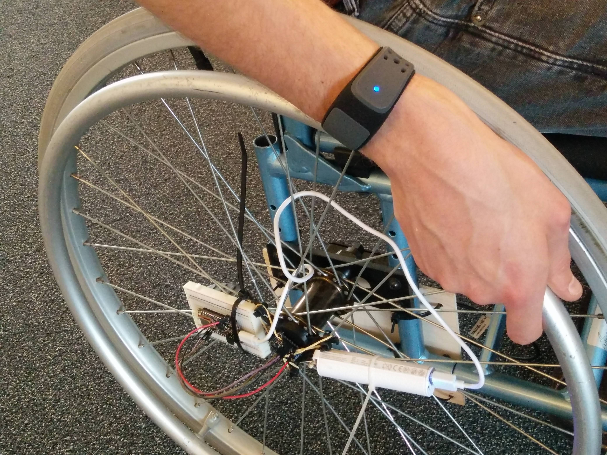
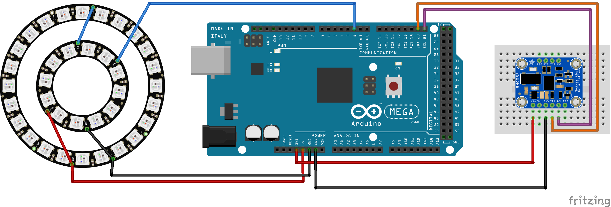
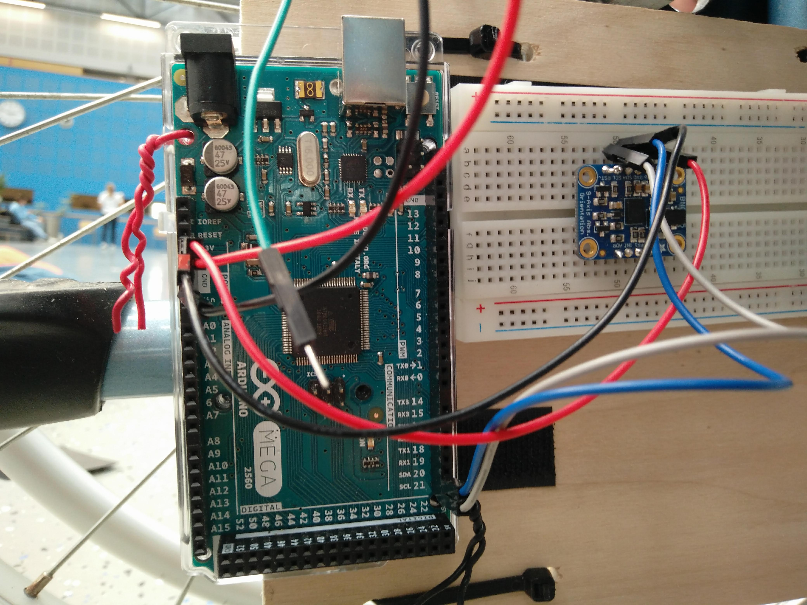

## PROJECT DOCUMENTATION

* [Project Description](README.md)
* [Sensors & Actuators](SENSORS_ACTUATORS.md)
* [Components](COMPONENTS.md)
* [Installation](INSTALLATION.md)
* [Testing](TESTING.md)
* [Changelog](CHANGELOG.md)


## INSTALLATION

 After collecting all the components as specified in [Components](COMPONENTS.md), follow these steps how to set everything up!

### Arduino

Download and install the (latest) Arduino software from the Arduino website (we used v 1.8.5) https://www.arduino.cc/en/Main/Software


#### Boards
The Arduino IDE already comes with everything needed for the Arduino Mega.

The Bluefruit board does need to be added manually:

Go to Tools -> Boards -> Boards Manager
Search for "bluefruit"
Install both the "adafruit AVR boards" and the "Adafruit nRF52".

Now the bluefruit should show up in your Tools -> Boards listed.

#### Libraries
In order to run the arduino sketches on this repository, the following libraries need to be install through Sketch -> Include Library -> Manage Libraries.
Search for "bluefruit nFF51" and click install.
Search for "adafruit BNO055" and click install.

#### Upload sketches
Upload the latest code in the SportsTracker_V1_Stable -> Arduino Mega folder to the Arduino Mega through the Arduino IDE.

Upload the latest code in the SportsTracker_V1_Stable -> BLE_Feather folder to the Bluefruit through the Arduino IDE.


### Raspberry Pi

Power up and connect to your Raspberry Pi in the way you prefer (i.e. over SSH or connect it to a monitor)

Then install the requirements as listed in the requirements.txt file through its terminal

On Mac:
```bash
pip3 install -r requirements.txt --user
```

Now install the Bluetooth dependencies for Python:

```bash
apt-get install bluez libbluetooth-dev

pip3 install git+https://github.com/peplin/pygatt

pip3 install "pygatt[GATTTOOL]"

pip3 install bluepy

pip3 install pexpect
```


### Connecting all the components

#### On the Wheel
Connect the Bluefruit with some jumper wires to the BNO055 using this schematic:



Connect the Bluefruit to the powerbank using the micro USB cable.

Now attach the whole assembly to the wheel of the wheelchair.
Make sure to attach the BNO055 to the center of the wheel's axle!



#### On your wrist

Put the Heartbeat sensor on your wrist, then push and hold the button to turn it on.



#### Below the chair

The Arduino Mega must be connected to the other BNO055 and the LED ring. Use the following schematics to do so:



Now mount the LED ring to the back of the wheelchair and the BNO055 in the orientation shown in the picture. The location of the Arduino mega itself is not as important.




Now mount the Raspberry Pi to the chair.
Connect the Raspberry Pi to the Arduino Mega with the USB cable
And finally mount the powerbank and connect it to the Raspberry Pi.


STEPS
1.	Download 	the folllowing files from github (wheelchair-design-platform/SportsTracker_V1_Stable):
							Chairbase.ino
							Rightsportswheelblefeather.ino
							Rpi_sportswheelchair.py
							BluefruitConfig.h
2.	Download & install Libraries: BNO055
												ADAFRUIT NEOPIXEL
												ADAFRUIT nRF51 BLE
4.  Upload Chairbase.ino to the Arduino Mega.
5.	Upload Rightsportswheelblefeather.ino to the Adafruit Feather.
6.	Upload Rpi_sportswheelchair.py to the Raspberry Pi.				
7.	Secure Arduino Mega to the wheelchair main frame.
8.	Secure Adafruit Feather to the right wheel.
9.	Secure Powerbank to the right wheel.
10.	Secure Powerbank to the wheelchair main frame.
11.	Secure Raspberry Pi to the wheelchair main frame.
12.	Secure LED ring to the back of the wheelchair.
13.	Secure BNO055 to the wheelchair main frame.
14.	Secure BNO055 on the central turning point of the right wheel.
15.	Connect the wires between the Arduino Mega and the BNO055 according to image (1).
16. Connect the wires between the Arduino Mega and the LED ring according to image (2).
17. Connect the Arduino Mega and Raspberry Pi using USB B cable.
18. Connect the Raspberry Pi and Powerbank using USB cable.
19. Connect the wires between the Adafruit Feather and the BNO055 according to image (3).
20. Connect the Adafruit Feather and Powerbank using Micro USB cable.
21.	Find & set Feather UUID.
22.	Find & set DCD thing token (see DCD website).
23. Find and select the correct data to display in Grafana.
24.	Equip the heartrate monitor.
25.	Start the heartrate monitor.
26.	Find the Raspberry Pi on your network.
27. Connect to the Raspberry Pi using ssh.
28. Execute the Rpi_sportswheelchair.py file.
29. Read values from the Grafana webpage.

The steps which the program takes in order to display the fitness rating to the coach are:

1.  Measure the rotation of the right wheel.
2.  Measure the travelled distance of the wheelchair.
3.  Measure the heartrate of the user.
4.  Combine the collected data to define how much energy the user has spend so far.
5.	Judge fitness based on heartrate and energy usage.
7.  Use the LED ring to display this data to the coach.
