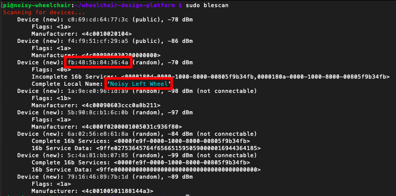

## PROJECT DOCUMENTATION

* [Project Description](README.md)
* [Sensors & Actuators](SENSORS_ACTUATORS.md)
* [Components](COMPONENTS.md)
* [Installation](INSTALLATION.md)
* [Testing](TESTING.md)
* [Changelog](CHANGELOG.md)


## INSTALLATION

 After collecting all the components as specified in [Components](COMPONENTS.md), follow these steps how to set everything up!

### Arduino

Download and install the (latest) Arduino software from the Arduino website (we used v 1.8.5) https://www.arduino.cc/en/Main/Software


##### Boards
The Arduino IDE already comes with everything needed for the Arduino Mega.

The Bluefruit board does need to be added manually:

Go to Tools -> Boards -> Boards Manager
Search for "bluefruit"
Install both the "adafruit AVR boards" and the "Adafruit nRF52".

Now the bluefruit should show up in your Tools -> Boards listed.

##### Libraries
In order to run the arduino sketches on this repository, the following libraries need to be install through Sketch -> Include Library -> Manage Libraries.
Search for "bluefruit nFF51" and click install.
Search for "adafruit BNO055" and click install.

##### Upload sketches
Upload the latest code in the SportsTracker_V1_Stable -> Arduino Mega folder to the Arduino Mega through the Arduino IDE.

Upload the latest code in the SportsTracker_V1_Stable -> BLE_Feather folder to the Bluefruit through the Arduino IDE.


### Raspberry Pi

Power up and connect to your Raspberry Pi in the way you prefer (i.e. over SSH or connect it to a monitor)

##### Install python requirements
Install the requirements as listed in the requirements.txt file through its terminal

On Mac:
```bash
pip3 install -r requirements.txt --user
```

Now install the Bluetooth dependencies for Python:

```bash
apt-get install bluez libbluetooth-dev

pip3 install git+https://github.com/peplin/pygatt

pip3 install "pygatt[GATTTOOL]"

pip3 install bluepy

pip3 install pexpect
```

##### Scan for BLE for the feather and find its Adress

We can use the command 'blescan' to scan the Bluetooth devices around. This way,
you can retrieve your Feather 32u4 with its name and identify its MAC address.

```bash
sudo blescan
```

Copy the MAC address and paste in your .env file as a new environment variable
'BLUETOOTH_DEVICE_MAC', for example:



```bash
BLUETOOTH_DEVICE_MAC=fb:48:5b:84:36:4a
```


### Connecting all the components

#### On the Wheel
Connect the Bluefruit with some jumper wires to the BNO055 using this schematic:


Connect the Bluefruit to the powerbank using the micro USB cable.

Now attach the whole assembly to the wheel of the wheelchair.
_Make sure to attach the BNO055 to the center of the wheel's axle!_
The result should look something like this:


#### On your wrist

Put the Heartbeat sensor on your wrist, then push and hold the button to turn it on.


#### Below the chair

The Arduino Mega must be connected to the other BNO055 and the LED ring. Use the following schematics to do so:


Now mount the LED ring to the back of the wheelchair and the BNO055 in the orientation shown in the picture. The location of the Arduino mega itself is not as important.


Now mount the Raspberry Pi to the chair.
Connect the Raspberry Pi to the Arduino Mega with the USB cable
And finally mount the powerbank and connect it to the Raspberry Pi.
