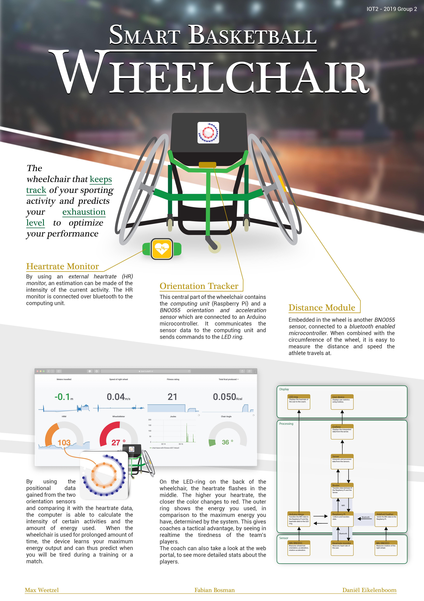
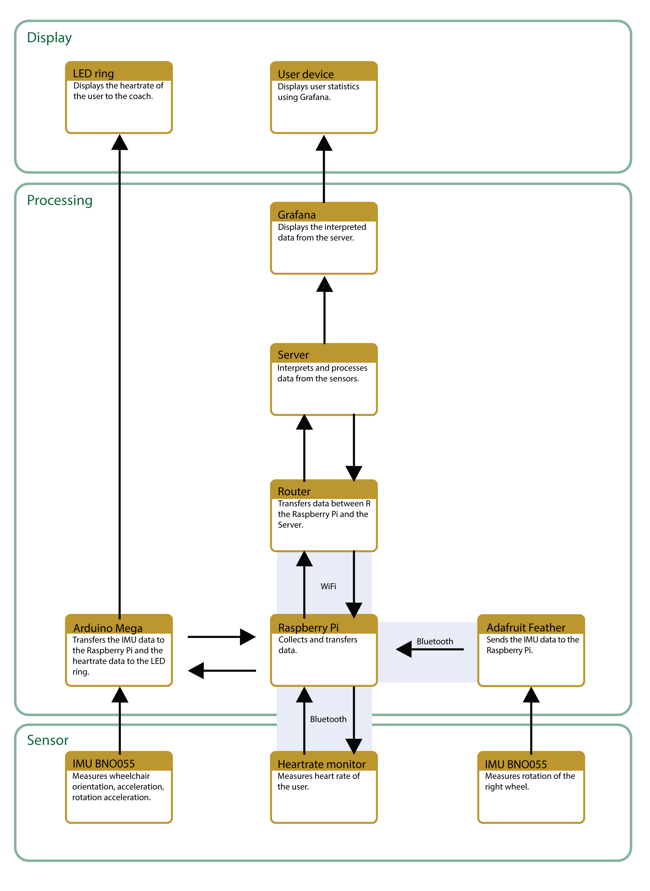

#### MENU

[Project Description](README.md) - [Sensors & Actuators](SENSORS_ACTUATORS.md) - [Components](COMPONENTS.md) - [Installation](INSTALLATION.md) - [Testing](TESTING.md) -  [Changelog](CHANGELOG.md)

## PROJECT DESCRIPTION

The goal of this project is to create a smart sports wheelchair which is able to monitor the consumed energy of a wheelchair basketball player in real time. This provides valuable insights for player and coach during training exercises.

For example, the current system allows a coach to view the energy the player has spent in relation to the heartrate of the user. The system then determines the fitness level of the user based on these parameters.

<iframe width="560" height="315" src="https://www.youtube.com/embed/18dqL9SPFqQ" frameborder="0" allow="accelerometer; autoplay; encrypted-media; gyroscope; picture-in-picture" allowfullscreen></iframe>

# Current functionality

__*INPUT*__
* Relative Position (speed, linear acceleration)
* Rotation, Rotational acceleration
* Heartbeat

__*OUTPUT*__
-	Displays heartrate and fitness level on LED ring.
- Enables insight in multiple variables of movement on Grafana:

   * velocity
   * acceleration
   * distance moved
   * rotation angle
   * spent kcal
   * heartrate
   * fitness rating (calculated from spent kcal versus heartrate)
   * tilt angle (wheelie meter)					

	 

*Project by Max Weetzel, Fabian Bosman and Daniël Eikelenboom.*

Thanks to the staff of the IoT2 course for organisation and guidance.

[Datacentric design github](https://datacentricdesign.github.io/wheelchair-design-platform/)
